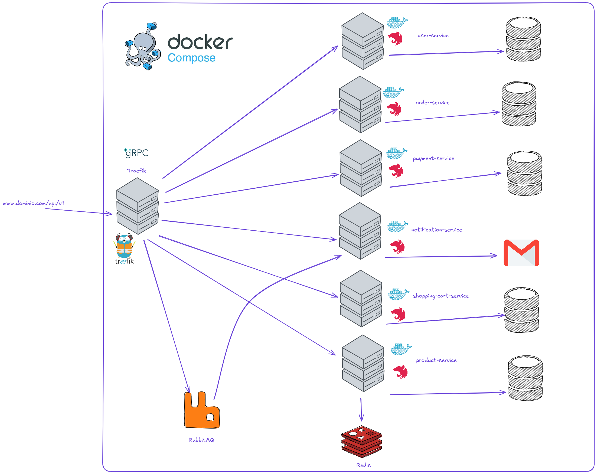

# Project Microservices for e-commerce

This a sample project demonstrating a microservices architecture for an e-commerce platform. The project consists of several independent services that communicate with each other to provide a complete e-commerce solution.

## Architecture 

